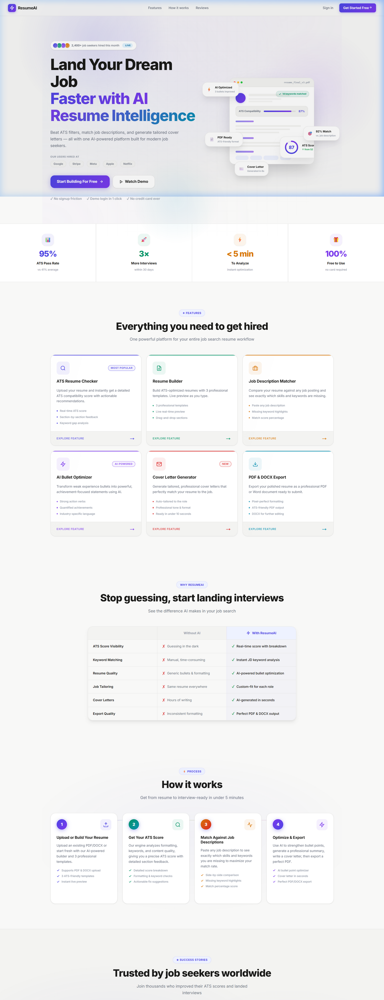
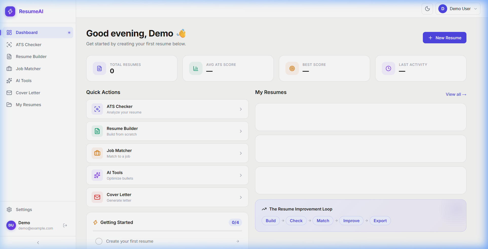
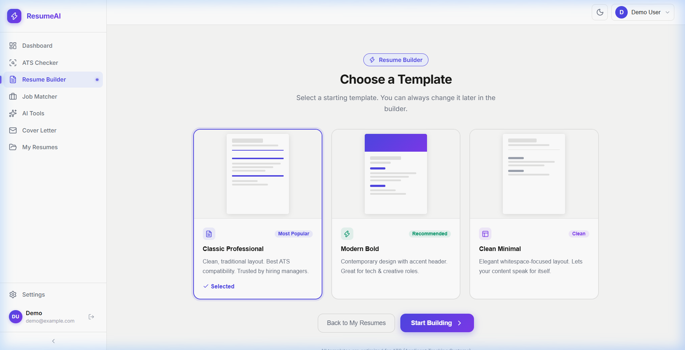
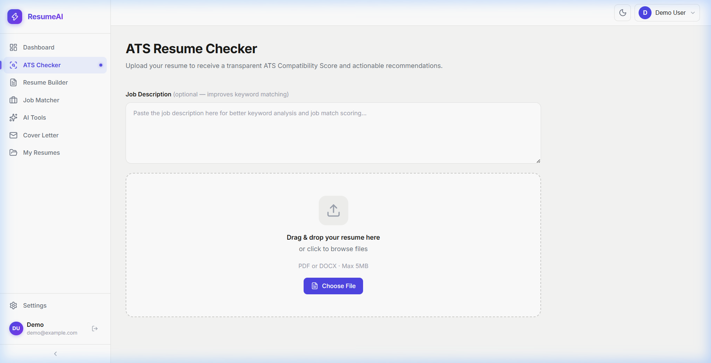

<div align="center">

# 🚀 AI ATS Resume Platform

### *The smartest way to land your dream job.*

**AI-powered Resume Builder · ATS Score Checker · Job Description Matcher · Cover Letter Generator**

[](https://nextjs.org/)
[](https://www.typescriptlang.org/)
[](https://www.mongodb.com/)
[](https://ai.google.dev/)
[](./LICENSE)
[](https://github.com/Rishabh893-ux/AI-ATS-RESUME-PLATFOORM/pulls)

<br/>

### 📸 Application Previews

<div align="center">
  
  <br><em>Landing Page</em><br><br>

  
  
  <br><em>Dashboard & Resume Builder</em><br><br>

  
  <br><em>ATS Score Checker</em>
</div>

<br/>

> A full-stack, AI-powered career platform that analyzes your resume against Applicant Tracking
> Systems (ATS), scores it in real-time, and helps you tailor it perfectly for any job —
> all wrapped in a beautiful, modern UI.

</div>

---

## ✨ Features

| Feature | Description |
|---|---|
| 📄 **Resume Builder** | Drag-and-drop editor with live preview and professional templates |
| 🤖 **ATS Score Checker** | Deep analysis via keyword extraction, semantic matching & formatting rules |
| 🎯 **Job Description Matcher** | Paste any JD and get a compatibility score with targeted suggestions |
| 💌 **Cover Letter Generator** | AI-crafted, job-specific cover letters via Google Gemini in seconds |
| 🔧 **AI Tools Suite** | Bullet improver, summary generator, and one-click resume tailoring |
| 📦 **Version History** | Save, compare, and restore any previous version of your resume |
| 📤 **Export Options** | Download your resume as a polished PDF or editable DOCX |
| 🔐 **Google OAuth** | Secure, one-click sign-in powered by NextAuth.js |

---

## 🛠️ Tech Stack

### Frontend
- **[Next.js 14](https://nextjs.org/)** — App Router, Server Components, API Routes
- **[React 18](https://react.dev/)** — Modern hooks & Suspense
- **[TypeScript 5](https://www.typescriptlang.org/)** — End-to-end type safety
- **[Zustand](https://zustand-demo.pmnd.rs/)** — Lightweight global state management
- **[dnd-kit](https://dndkit.com/)** — Accessible drag-and-drop for the resume builder
- **[Lucide React](https://lucide.dev/)** — Clean, consistent icons
- **CSS Modules** — Scoped styles with glassmorphism & dark theme

### Backend
- **[Next.js API Routes](https://nextjs.org/docs/app/building-your-application/routing/route-handlers)** — Serverless REST endpoints
- **[NextAuth.js](https://next-auth.js.org/)** — Authentication with Google OAuth 2.0
- **[MongoDB + Mongoose](https://mongoosejs.com/)** — Flexible document database

### AI / NLP
- **[Google Gemini API](https://ai.google.dev/)** — Cover letters, summaries & tailoring
- **Custom ATS Engine** — Keyword extractor, semantic matcher, formatting checker, section validator
- **[Natural](https://naturalnode.github.io/natural/)** — NLP tokenization & stemming
- **[pdf-parse](https://www.npmjs.com/package/pdf-parse)** — Resume PDF parsing
- **[Mammoth](https://github.com/mwilliamson/mammoth.js)** — DOCX file parsing

---

## 🏗️ Project Structure

```
src/
├── app/
│   ├── (app)/                  # Protected routes (require auth)
│   │   ├── dashboard/          # Main dashboard & stats
│   │   ├── ats-checker/        # ATS score checker
│   │   ├── resume-builder/     # Resume editor (list + [id] detail)
│   │   ├── cover-letter/       # AI cover letter generator
│   │   ├── job-matcher/        # Job description matcher
│   │   ├── my-resumes/         # Saved resumes library
│   │   ├── ai-tools/           # AI tools hub
│   │   └── settings/           # User profile & settings
│   ├── api/                    # REST API handlers
│   │   ├── auth/               # NextAuth [...nextauth] route
│   │   ├── resumes/            # CRUD + analyze/export/versions/restore
│   │   ├── cover-letter/       # Cover letter generation
│   │   ├── job-match/          # Job compatibility scoring
│   │   ├── tailor/             # AI resume tailoring
│   │   ├── upload/             # File upload (PDF/DOCX)
│   │   └── ai/                 # General AI tools endpoint
│   ├── login/                  # Login page
│   └── page.tsx                # Public landing page
├── components/
│   ├── builder/                # BuilderSidebar, ResumePreview, ResumeToolbar
│   ├── layout/                 # AppShell, Header, Sidebar
│   ├── auth/                   # SessionProvider wrapper
│   └── ui/                     # Button, ScoreRing, Toast
├── lib/
│   ├── ai/                     # Gemini: coverLetterGen, resumeTailor, bulletImprover, summaryGenerator
│   ├── ats-engine/             # index, keywordExtractor, semanticMatcher, formattingChecker, sectionChecker, scoreWeights
│   ├── models/                 # Mongoose: Resume, ResumeVersion, ATSAnalysis, CoverLetter, JobMatch
│   ├── parsers/                # pdfParser, docxParser, structureExtractor
│   ├── db/                     # mongoose.ts connection
│   └── auth.ts                 # NextAuth configuration
├── store/
│   ├── resumeStore.ts          # Zustand: resume builder state
│   └── uiStore.ts              # Zustand: UI / modal state
└── types/
    ├── resume.ts
    ├── ats.ts
    └── ai.ts
```

---

## 🚀 Getting Started

### Prerequisites

| Tool | Minimum Version |
|---|---|
| Node.js | 18.0.0 |
| npm | 9.0.0 |
| MongoDB | Atlas free tier or local |

You also need:
- A **Google Cloud** project with **OAuth 2.0** credentials
- A **Google Gemini API** key from [Google AI Studio](https://aistudio.google.com/)

### Installation

```bash
# 1. Clone the repository
git clone https://github.com/Rishabh893-ux/AI-ATS-RESUME-PLATFOORM.git
cd ai-ats-resume-platform

# 2. Install dependencies
npm install

# 3. Set up environment variables
cp .env.example .env.local
# Edit .env.local and fill in all values

# 4. Run the development server
npm run dev
```

Open **http://localhost:3000** in your browser. 🎉

### Production Build

```bash
npm run build
npm start
```

---

## ⚙️ Environment Variables

| Variable | Required | Description |
|---|---|---|
| `MONGODB_URI` | ✅ | MongoDB Atlas connection string |
| `NEXTAUTH_SECRET` | ✅ | NextAuth session encryption secret (generate with: `openssl rand -base64 32`) |
| `NEXTAUTH_URL` | ✅ | App base URL (`http://localhost:3000` in development) |
| `GOOGLE_CLIENT_ID` | ✅ | Google OAuth 2.0 Client ID |
| `GOOGLE_CLIENT_SECRET` | ✅ | Google OAuth 2.0 Client Secret |
| `GEMINI_API_KEY` | ✅ | Google Gemini API key |

---

## 📡 API Reference

### Resume Endpoints

| Method | Endpoint | Description |
|---|---|---|
| `GET` | `/api/resumes` | List all user resumes |
| `POST` | `/api/resumes` | Create a new resume |
| `GET` | `/api/resumes/[id]` | Get a single resume |
| `PUT` | `/api/resumes/[id]` | Update a resume |
| `DELETE` | `/api/resumes/[id]` | Delete a resume |
| `POST` | `/api/resumes/[id]/analyze` | Run full ATS analysis |
| `GET` | `/api/resumes/[id]/export` | Export as PDF or DOCX |
| `GET` | `/api/resumes/[id]/versions` | List version history |
| `POST` | `/api/resumes/[id]/restore` | Restore a saved version |

### AI & Tools Endpoints

| Method | Endpoint | Description |
|---|---|---|
| `POST` | `/api/cover-letter` | Generate an AI cover letter |
| `POST` | `/api/job-match` | Match resume to a job description |
| `POST` | `/api/tailor` | AI-tailor resume for a specific role |
| `POST` | `/api/upload` | Parse & upload a resume file (PDF/DOCX) |
| `POST` | `/api/ai` | General AI tools (bullets, summary) |

---

## 📋 Roadmap

- [ ] LinkedIn profile import & auto-fill
- [ ] More resume templates (creative, minimal, executive)
- [ ] Stripe-powered Pro subscription
- [ ] Real-time collaborative editing
- [ ] Interview prep Q&A generator
- [ ] Chrome extension for one-click job application autofill

---

## 🤝 Contributing

Contributions, issues, and feature requests are all welcome!

1. **Fork** the repository
2. **Create** your feature branch: `git checkout -b feature/amazing-feature`
3. **Commit** your changes: `git commit -m "feat: add amazing feature"`
4. **Push** to your branch: `git push origin feature/amazing-feature`
5. **Open** a Pull Request

> Please ensure `npx tsc --noEmit` and `npm run lint` both pass before submitting.

---

## 📄 License

Distributed under the **MIT License**. See [LICENSE](./LICENSE) for more information.

---

## 👨‍💻 Author

Made with passion by **Rishabh**

- GitHub: [@Rishabh893-ux](https://github.com/Rishabh893-ux)

---

<div align="center">

### ⭐ If this project helped you, please give it a star! ⭐

*Built with Next.js 14 · Google Gemini AI · MongoDB · TypeScript*

</div>
